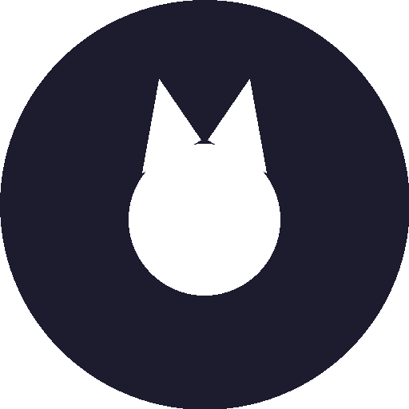

<p align="center">
  
</p>

# Gato Client Mobile

**Gato Client Mobile** is an open-source utility client for **Minecraft Bedrock Edition**. It uses a **MITM (Man-in-the-Middle)** approach to provide gameplay enhancements — **without modifying the game's memory or requiring root access.**

Recommended Minecraft version: **v1.26.50** (protocol 2192). The bundled relay auto-negotiates older client versions (1.13 → 1.26.50).

---

## 🔧 How it works

1. **GatoRelay** (`relay/`) is a JVM library that opens a local RakNet proxy (`0.0.0.0:19132`) advertising itself as a Bedrock server.
2. You point Minecraft (or any Bedrock device on your network) at the phone running this app.
3. Every packet flows through the relay's listener chain, where modules can read and rewrite it in both directions — login, gameplay, transfers.

## 📱 Platform support

Any Minecraft Bedrock platform can connect through the MITM running on Android:

- **Android** · **iOS** · **Windows 10 & 11** · **Nintendo Switch** · **Xbox (limited)**

---

## 🛠️ How to build

1. **Build GatoRelay** (requires JDK 17):
   ```
   cd relay
   ./gradlew jar
   ```
   The jar is generated at `relay/build/libs/GatoRelay.jar`.

2. **Copy the jar** into the app:
   ```
   cp relay/build/libs/GatoRelay.jar app/libs/
   ```

3. **Assemble the APK** (requires the Android SDK, API 35):
   ```
   ./gradlew :app:assembleRelease
   ```
   The APK lands at `app/build/outputs/apk/release/`.

> This repository ships both projects: the Android app in `app/` and the relay sources in `relay/` (vendoring [CloudburstMC Protocol](https://github.com/CloudburstMC/Protocol) and [CloudburstMC Network](https://github.com/CloudburstMC/Network)).

---

## License

This project is licensed under the **GNU Affero General Public License v3.0** — see [LICENSE](LICENSE).

It is based on [MuCuteClient](https://github.com/OpenMITM/MuCuteClient) (GPLv3) and [MuCuteRelay](https://github.com/OpenMITM/MuCuteRelay); the GPLv3 text covering those derived portions is included at [LICENSES/GPL-3.0-MuCuteClient.txt](LICENSES/GPL-3.0-MuCuteClient.txt). The vendored CloudburstMC protocol stack is Apache 2.0.

### ✅ Permitted uses

- Personal use and modification.
- Creating content (e.g., videos or showcases) using Gato Client Mobile.
- Redistributing the original or modified source code, provided the same license terms are included and the source code is made available.

---

## 🤝 Credits

- **[MuCuteClient](https://github.com/OpenMITM/MuCuteClient)** — original project (CaiMuCheng, LodingGlue, MrPokeG, lyssadev, Answer2, Hax0r, RadiantByte and contributors)
- **[CloudburstMC](https://github.com/CloudburstMC)** — Bedrock protocol & RakNet implementation
- **[MinecraftAuth](https://github.com/RaphiMC/MinecraftAuth)** — Microsoft/Xbox authentication
- **elgatolinux** — Gato Client Mobile fork & rebrand

---

## ⚠️ Disclaimer

Gato Client Mobile is not affiliated with Mojang Studios, Microsoft, or any official Minecraft development team.

Use Gato Client Mobile at your **own risk**.
We are **not responsible** for any bans, penalties, or issues that may result from using this client.

**Always follow server rules and respect community standards.**
